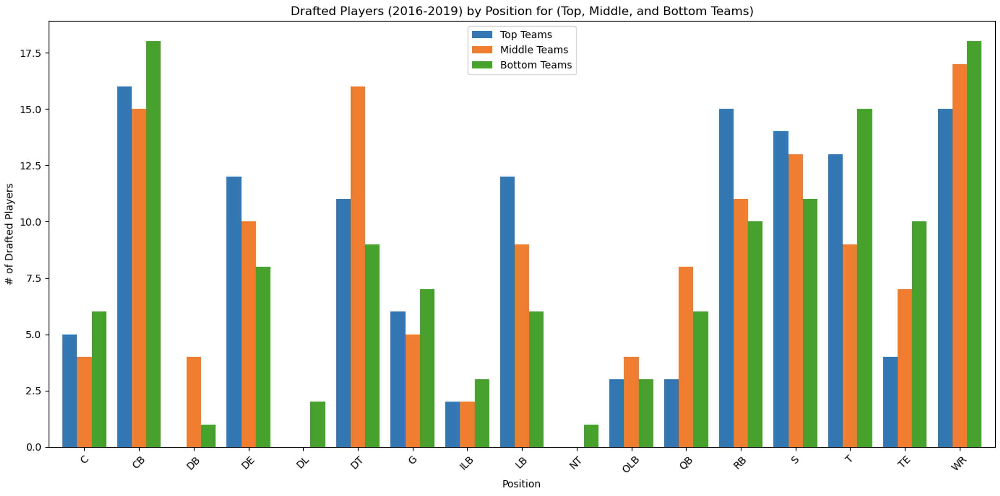
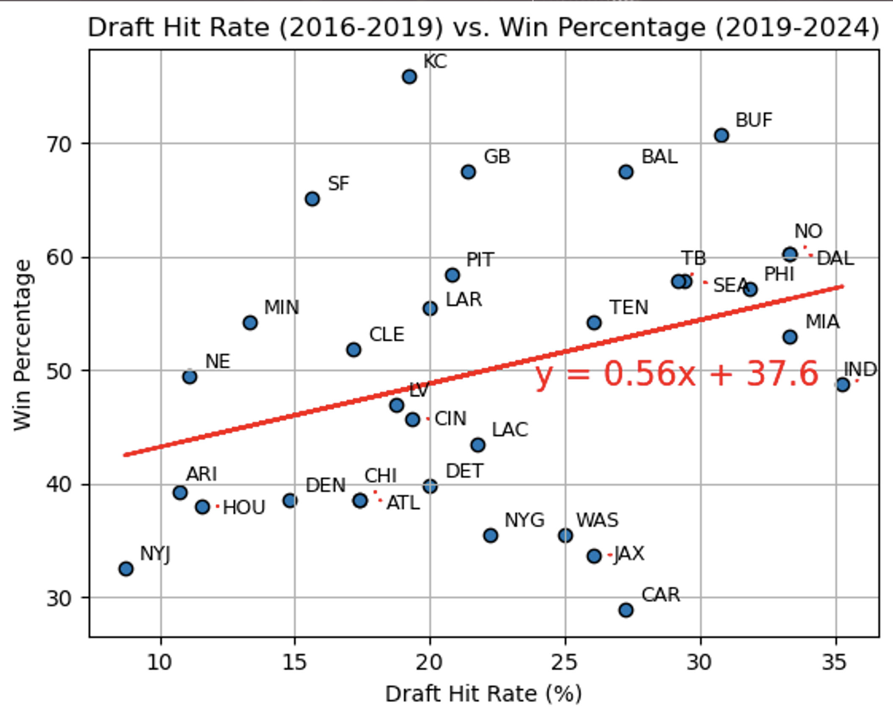
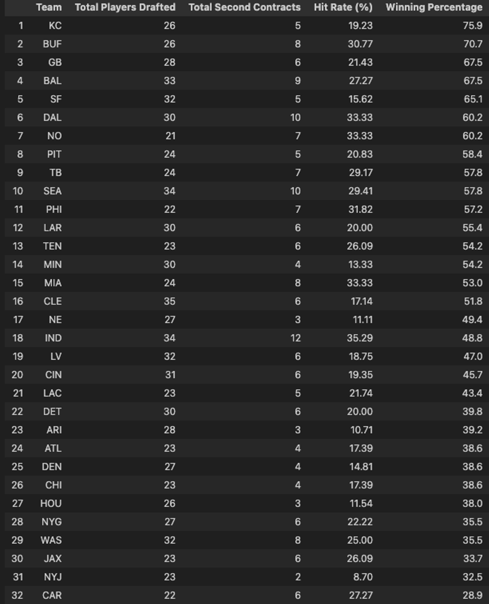

```markdown
# Analyzing NFL Draft Trends and Contracts Over the Last Four Years

## Team Members
- **Luis Llamas**
- **Jack Thomas**
- **Christian Fincher**
- **Santiago Cardenas**

## Project Description
This project investigates the factors influencing NFL players' likelihood of receiving a second contract with the same team. Focusing on the 2016 to 2019 draft classes, we analyze attributes such as draft positions, player performance metrics, positional value, initial contract length, performance statistics, injury history, and team dynamics.

### Key Aspects to Explore
1. **Positional Analysis:** Determine which positions are most likely to have players secure a second contract with the same team.
2. **Performance Metrics:** Identify performance metrics (e.g., games played, touchdowns, tackles) that correlate with receiving a second contract.
3. **Draft Position Impact:** Assess how draft position (early vs. late rounds) influences the chances of obtaining a second contract.
4. **Contract Length and Value:** Compare the typical contract lengths and values of players who secure a second contract versus those who do not.
5. **Team Strategies:** Explore different team strategies for drafting and retaining players.
6. **Injury History:** Evaluate the impact of injury history on the likelihood of securing a second contract.
7. **Player Development:** Examine the role of player development and support systems within teams in retaining players.
8. **Economic Factors:** Analyze the financial aspects and salary cap implications affecting second contract decisions.
9. **Career Longevity:** Compare the career longevity of players who secure a second contract with the same team to those who move to other teams.
10. **Comparative Analysis:** Use other teams as baselines to determine the relative success of different strategies in securing second contracts for their draft picks.

### Datasets to Be Used
- [nfldatapy](https://pypi.org/project/nfldatapy/): A Python library providing data on NFL draft picks, player statistics, and contract details.
- [NFL Contract and Draft Data](https://www.kaggle.com/datasets/nicholasliusontag/nflcontractanddraftdata): Contains NFL contracts and draft pick data for players between 2000 and 2023.

### Rough Breakdown of Tasks
- **Luis Llamas:** Set up the GitHub repository, create README.md file, and PPT presentation.
- **Santiago Cardenas:** Data collection and preprocessing.
- **Christian Fincher:** Statistical analysis and report writing.
- **Jack Thomas:** Data analysis and visualization.

### Project Proposal
- **Title:** Analyzing NFL Draft Trends and Contracts Over the Last Four Years
- **Description:** Identifying key factors from recent NFL draft classes that contribute to a player's likelihood of securing a successful second contract with the same team.

### Data Standardization and Analysis
- **Data Standardization:** Develop a dictionary to standardize team names and use a `.map` function to replace team names in the dataset with standardized names.
- **Identify Second Contracts:** Create a new column to indicate if a player has signed a second contract.
- **Expand Dataset:** Consider expanding the dataset to include second-round picks for comparison.
- **Player Records:** Ensure each player is uniquely counted and not duplicated in the dataset.

## Visualizations
### Visualization 1: 2016 -2019 Drafted Players by Position


### Visualization 2: Draft Hit Rate vs. Win Percentage


### Visualization 3: Total Second Contracts

```

